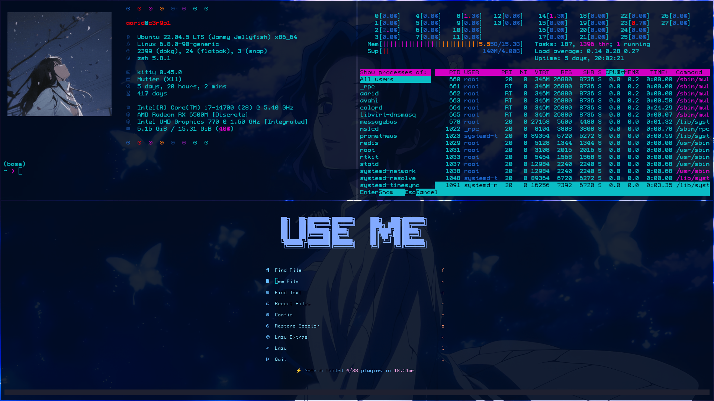

# 💻 school-config

A high-performance Linux development environment tailored for school machines (iMacs/PCs) with restricted home storage. This setup utilizes **Goinfre** (local SSD) for heavy data while keeping configuration files synced via Git and physical backups via USB.

---

## 🚀 Key Features

* **Storage Portals**: Symbolic links redirect heavy directories (`conda`, `nvim-plugins`, `vscode-extensions`) to the local SSD (`/goinfre`) to bypass home directory quotas.
* **Standalone Apps**: Kitty and Fastfetch are installed as standalone binaries to avoid dependency conflicts with Conda.
* **Tiling Interface**: Automated GNOME ricing using **Forge** and **Tiling Assistant**.
* **USB Persistence**: `rsync`-based scripts to mirror your entire workspace to an `ext4` USB drive for mobility.

---

## 📂 Repository Structure

| File/Folder | Description |
| :--- | :--- |
| `.config/` | Rice configurations for Nvim, Kitty, Forge, and Htop. |
| `install.sh` | Main setup script to link dotfiles and install binaries. |
| `init_goinfre.sh` | Creates the SSD directory structure and symlinks. |

  ***Save goinfre to a usb to avoid loseing it***
| `take_backup_to_usb.sh` | Mirrors `/goinfre/$USER` to your USB drive. |
  
  ***Restore goinfre from the usb to avoid loseing it***
| `restore_backup_from_usb.sh` | Restores data from USB to the local SSD. |
| `save_extensions_config` | Dumps current GNOME/Forge settings to `.conf` files. |
| `.zshrc` | Optimized Zsh config with fast startup logic. |

---

## 🛠 Setup & Installation

`On a new machine, clone the repository and run the installer:`

```bash
git clone git@github.com:out-0/school-config.git ~/school-config
cd ~/school-config
chmod +x *.sh
./install.sh
```
```
```


## The Morning & Evening Routine

### 📥 When you arrive (Restore)


`Plug in your USB and pull your data onto the computer's fast SSD:
Bash`

```bash
./restore_backup_from_usb.sh
```


### 📤 When you leave (Backup)

`Sync your changes back to the USB to take your work home: Bash`

```bash
./take_backup_to_usb.sh
sync
```


- Terminal: Kitty (Borderless & Ligatures)

- Shell: Zsh (Powerlevel10k/Oh-My-Zsh)

- Editor: Neovim (LazyVim)

- Window Manager: GNOME with Forge (Tiling)

- System Info: Fastfetch

# Overview


