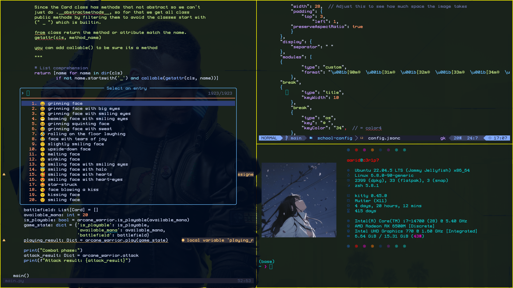

# 💻 school-config

A high-performance Linux development environment tailored for school machines (iMacs/PCs) with restricted home storage. This setup utilizes **Goinfre** (local SSD) for heavy data while keeping configuration files synced via Git and physical backups via USB.

---

## 🚀 Key Features

* **Storage Portals**: Symbolic links redirect heavy directories (`conda`, `nvim-plugins`, `vscode-extensions`) to the local SSD (`/goinfre`) to bypass home directory quotas.
* **Standalone Apps**: Kitty and Fastfetch are installed as standalone binaries to avoid dependency conflicts with Conda.
* **Tiling Interface**: Automated GNOME ricing using **Forge** and **Tiling Assistant**.
* **USB Persistence**: `rsync`-based scripts to mirror your entire workspace to an `ext4` USB drive for mobility.

---

## 📂 Repository Structure

| File/Folder | Description |
| :--- | :--- |
| `.config/` | Rice configurations for Nvim, Kitty, Forge, and Htop. |
| `install.sh` | Main setup script to link dotfiles and install binaries. |
| `init_goinfre.sh` | Creates the SSD directory structure and symlinks. |

- Terminal: Kitty (Borderless & Ligatures)

- Shell: Zsh (Powerlevel10k/Oh-My-Zsh)

- Editor: Neovim (LazyVim)

- Window Manager: GNOME with Forge (Tiling)

- System Info: Fastfetch

# Overview

